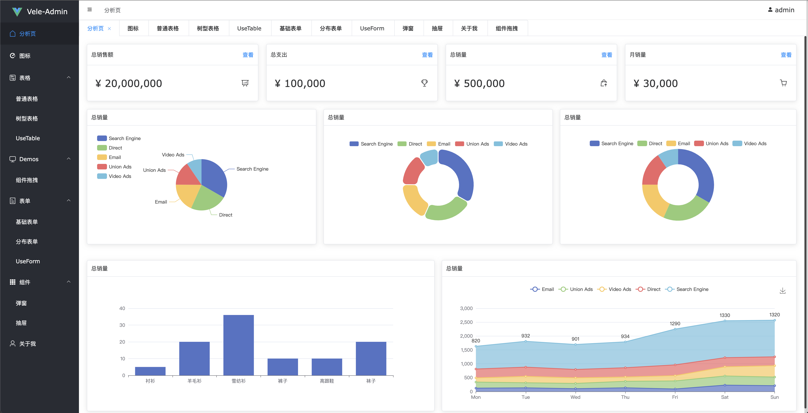

# vele-admin

## Introduction

一个基于 vue3, vite2, element-plus, vuex, vue-router, typescript 的后台管理系统

本项目受[vue-vben-admin](https://github.com/anncwb/vue-vben-admin)影响很多，如果喜欢 Antd 组件库的可以直接使用 Vben。

本项目骨架借鉴了很多 Vben 的地方，不过也做了很多减法。相比 Vben 的，本项目轻量了许多，适合一些比较小型的后台管理系统，或者相比 antd 喜欢使用 element 的开发者。

目前我正在做 Vben 自定义组件的移植工作，目前移植了 Drawer、Dialog、Form 组件，实现了类似 Vben 组件的正常功能。当然，相比 Vben 的组件，简化了许多。移植组件主要也是为了学习 Vben 的 hook 写法和思路，不能保证组件的稳定性和功能的足够完善，希望大家谅解。有兴趣的小伙伴可以和我一起移植学习，非常欢迎。

## Preview

服务器很久没有维护了，域名也到期了

[github pages 地址](https://shellingfordly.github.io/vele-admin)



## Preparation

- [Vue3](https://v3.vuejs.org/)
- [Vue-Router-Next](https://next.router.vuejs.org/)
- [Vuex-Module-Decorators](https://github.com/championswimmer/vuex-module-decorators)
- [Vite](https://vitejs.dev/)
- [TypeScript](https://www.typescriptlang.org/)
- [Element-Plus](https://element-plus.gitee.io/zh-CN/)
- [Mock.js](https://github.com/nuysoft/Mock)

## Download

```
git clone https://github.com/shellingfordly/vele-admin.git
```

## Install

```
yarn install or npm install
```

## Run

```
yarn dev or npm run dev
```

## Build

```
yarn build or npm run build
```

## Related Warehouse

- [vue-vben-admin](https://github.com/anncwb/vue-vben-admin) 一个基于 composition-api+ts 的后台模板
- [vue-element-admin](https://github.com/PanJiaChen/vue-element-admin) 一个后台前端解决方案，它基于 vue 和 element-ui 实现
